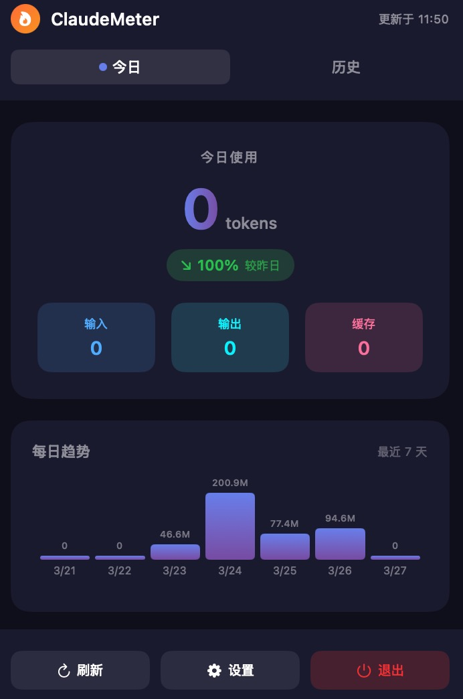
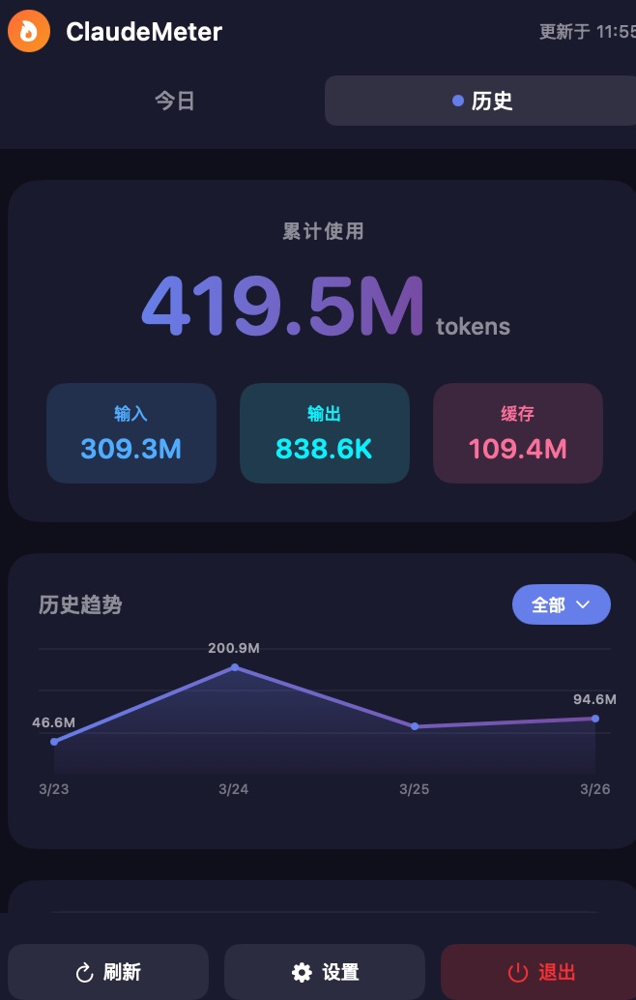
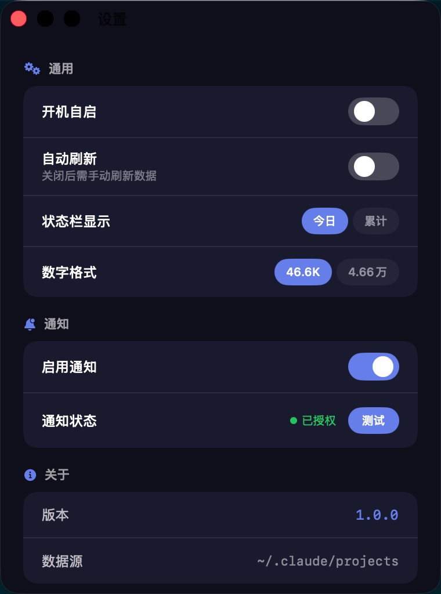

# ClaudeMeter

<p align="center">
  <strong>A minimal and elegant Claude Code usage tracker</strong>
</p>

<p align="center">
  Monitor your Claude Code token usage in real-time from the macOS menu bar
</p>

<p align="center">
  
</p>

## Features

- **Real-time Monitoring** - Display token usage directly in the status bar
- **Today/History Views** - Switch between today's data and historical records
- **Visual Charts** - Daily trend bar chart and historical line chart
- **Project/Model Statistics** - Token usage breakdown by project and model
- **Monthly Filtering** - Filter historical data by month
- **Desktop Notifications** - Test notification support
- **Launch at Login** - Optional auto-start on login
- **Auto Refresh** - Configurable refresh intervals

## Screenshots

<p align="center">
  
  
  
</p>

## Requirements

- macOS 14.0 (Sonoma) or later
- Claude Code installed and used

## Installation

### Option 1: Download

1. Download `ClaudeMeter.app` from [Releases](https://github.com/WenmuZhou/ClaudeMeter/releases)
2. Move to your Applications folder
3. On first launch, right-click → Open (to bypass Gatekeeper)

### Option 2: Build from Source

```bash
# Clone the repository
git clone https://github.com/WenmuZhou/ClaudeMeter.git
cd ClaudeMeter

# Build with the script
./build.sh

# Or build manually with Xcode
# open ClaudeMeter.xcodeproj
# Press Cmd+R to run
```

## Data Source

ClaudeMeter reads directly from Claude Code local log files:

- `~/.claude/projects/` (default path)
- `~/.config/claude/projects/` (XDG standard)
- Including subagents subdirectories

All data processing happens locally. No API keys needed, no data leaves your computer.

## Settings

| Setting | Description |
|---------|-------------|
| Launch at Login | Automatically start the app on login |
| Auto Refresh | Automatically refresh usage data |
| Refresh Interval | Set the auto-refresh time interval |
| Status Bar Display | Show today's or total tokens |
| Number Format | K/M format or 万/千万 format |
| Enable Notifications | Turn on desktop notifications |

## Development

### Project Structure

```
ClaudeMeter/
├── ClaudeMeter/
│   ├── ClaudeMeterApp.swift      # App entry point
│   ├── PopoverView.swift         # Main UI
│   ├── UsageManager.swift        # Data management
│   ├── StatusBarController.swift # Status bar control
│   ├── SettingsView.swift        # Settings UI
│   ├── SettingsManager.swift     # Settings storage
│   └── PricingManager.swift      # Pricing calculation
├── ClaudeMeter.xcodeproj/
├── imgs/
├── build.sh
└── README.md
```

### Tech Stack

- Swift / SwiftUI
- NSStatusItem / NSPopover
- Combine
- UserNotifications

## Acknowledgments

Data extraction logic inspired by [ccusage](https://github.com/ryoppippi/ccusage).

## License

MIT
