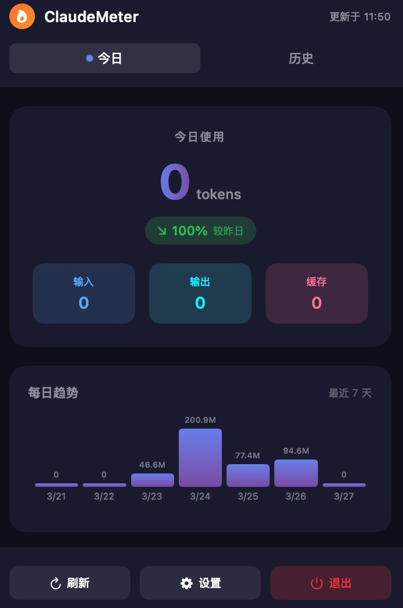
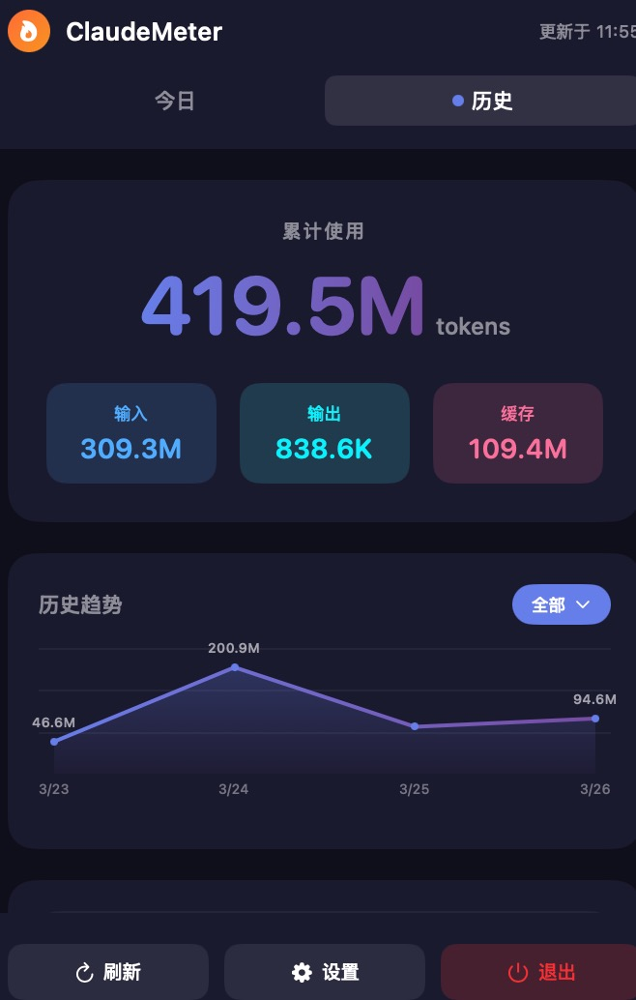
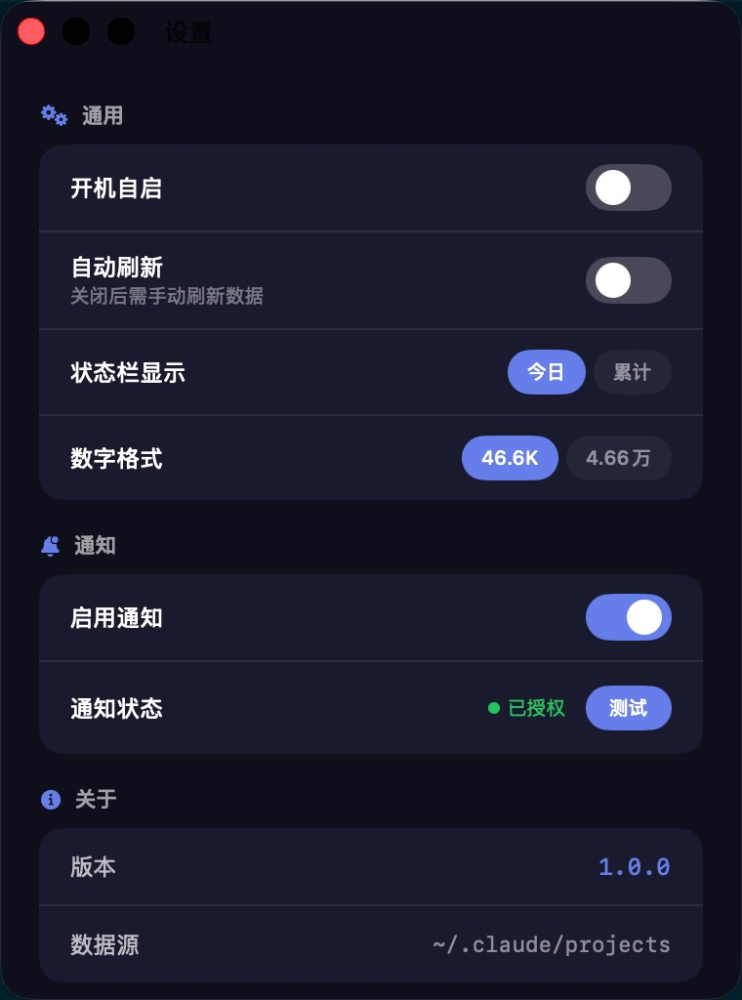

# ClaudeMeter

<p align="center">
  <strong>简洁优雅的 Claude Code 用量追踪工具</strong>
</p>

<p align="center">
  在 macOS 菜单栏实时监控你的 Claude Code Token 用量
</p>


## 功能特性

- **实时监控** —— 在状态栏直接显示 Token 用量
- **今日 / 历史视图** —— 在今日数据和历史记录之间切换
- **可视化图表** —— 每日趋势柱状图 + 历史折线图，鼠标悬停显示该点的具体数据
- **灵活的历史维度** —— 历史折线图支持按月 / 周 / 日汇总，数据较多时可左右滑动
- **项目 / 模型统计** —— 按项目和模型拆分 Token 用量
- **按月筛选** —— 按月份筛选历史数据
- **持久化存储** —— 解析后的日志存入本地数据库，重启无需重新解析，每次扫描均为增量
- **深色 / 浅色模式** —— 可跟随系统，也可固定浅色 / 深色，切换时带波纹过渡动画
- **桌面通知** —— 可选的桌面通知支持
- **开机自启** —— 可选登录时自动启动
- **自动刷新** —— 刷新间隔可配置

## 截图

<p align="center">
  
  
  
</p>

## 环境要求

- macOS 14.0 (Sonoma) 或更高版本
- 已安装并使用过 Claude Code

## 安装

### 方式一：下载

1. 从 [Releases](https://github.com/WenmuZhou/ClaudeMeter/releases) 下载最新版本
2. 解压后将 `ClaudeMeter.app` 移动到「应用程序」文件夹
3. 首次启动时右键点击 → 打开（以绕过 Gatekeeper）

### 方式二：从源码构建

```bash
# 克隆仓库
git clone https://github.com/WenmuZhou/ClaudeMeter.git
cd ClaudeMeter

# 用脚本构建（产物 ClaudeMeter.app 输出到项目根目录）
./build.sh

# 或用 Xcode 手动构建
# open ClaudeMeter.xcodeproj
# 按 Cmd+R 运行
```

## 数据来源

ClaudeMeter 直接读取 Claude Code 的本地日志文件：

- `~/.claude/projects/`（默认路径）
- `~/.config/claude/projects/`（XDG 标准路径）
- 包含 subagents 子目录

解析后的记录会缓存进本地 SwiftData 数据库，因此 app 启动即用，每次刷新只扫描新变更的日志文件。所有数据处理均在本地完成，无需 API Key，数据不会离开你的电脑。

## 设置项

| 设置 | 说明 |
|------|------|
| 外观 | 跟随系统，或固定浅色 / 深色 |
| 开机自启 | 登录时自动启动 app |
| 自动刷新 | 自动刷新用量数据 |
| 刷新间隔 | 设置自动刷新的时间间隔 |
| 状态栏显示 | 显示今日或累计 Token |
| 数字格式 | K/M 格式或 万/千万 格式 |
| 启用通知 | 开启桌面通知 |

## 开发

### 项目结构

```
ClaudeMeter/
├── ClaudeMeter/
│   ├── ClaudeMeterApp.swift      # App 入口
│   ├── StatusBarController.swift # 菜单栏图标与 popover 控制
│   ├── PopoverView.swift         # 主界面
│   ├── SettingsView.swift        # 设置界面
│   ├── UsageManager.swift        # 用量数据加载与聚合
│   ├── DataStore.swift           # SwiftData 持久化（增量扫描）
│   ├── SettingsManager.swift     # 设置存储
│   ├── PricingManager.swift      # 价格计算
│   ├── Theme.swift               # 设计 token（颜色、字体、间距）
│   ├── Color+Hex.swift           # 颜色工具（hex 与浅/深自适应）
│   ├── ProjectPath.swift         # 项目路径解码
│   └── Logging.swift             # 统一日志
├── ClaudeMeter.xcodeproj/
├── imgs/
├── build.sh
└── README.md
```

### 技术栈

- Swift / SwiftUI
- SwiftData（本地持久化）
- NSStatusItem / NSPopover
- Combine
- UserNotifications

## 致谢

数据提取逻辑参考自 [ccusage](https://github.com/ryoppippi/ccusage)。

## 许可证

MIT
